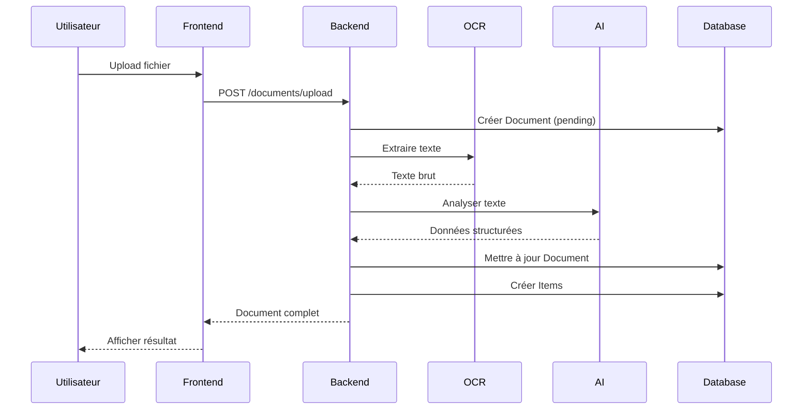
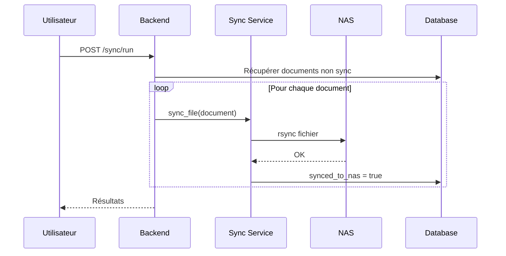

# Vue d'ensemble de l'architecture

## Architecture globale

Finance Manager est une application web moderne avec une architecture découplée :

```
┌─────────────────────────────────────────────────────────────────┐
│                         FRONTEND                                 │
│  ┌─────────────────────────────────────────────────────────┐    │
│  │                    React 18 + Vite                       │    │
│  │  ┌─────────┐ ┌─────────┐ ┌─────────┐ ┌─────────┐       │    │
│  │  │Dashboard│ │Documents│ │  Tags   │ │ Budgets │       │    │
│  │  └─────────┘ └─────────┘ └─────────┘ └─────────┘       │    │
│  │                      │                                   │    │
│  │                ┌─────▼─────┐                            │    │
│  │                │  API.ts   │  Axios + JWT               │    │
│  │                └───────────┘                            │    │
│  └─────────────────────┬───────────────────────────────────┘    │
└─────────────────────────┼───────────────────────────────────────┘
                          │ REST API
┌─────────────────────────▼───────────────────────────────────────┐
│                         BACKEND                                  │
│  ┌─────────────────────────────────────────────────────────┐    │
│  │                    FastAPI                               │    │
│  │  ┌─────────────────────────────────────────────────┐    │    │
│  │  │                   Routes API                     │    │    │
│  │  │  /auth  /documents  /tags  /budgets  /stats     │    │    │
│  │  │  /export  /sync  /currencies                     │    │    │
│  │  └───────────────────┬─────────────────────────────┘    │    │
│  │                      │                                   │    │
│  │  ┌───────────────────▼─────────────────────────────┐    │    │
│  │  │                  Services                        │    │    │
│  │  │  ┌─────┐ ┌─────┐ ┌─────┐ ┌─────┐ ┌─────┐       │    │    │
│  │  │  │ OCR │ │ AI  │ │Export│ │Sync │ │Curr.│       │    │    │
│  │  │  └──┬──┘ └──┬──┘ └─────┘ └──┬──┘ └─────┘       │    │    │
│  │  └─────┼───────┼───────────────┼────────────────────┘    │    │
│  │        │       │               │                         │    │
│  │  ┌─────▼──┐ ┌──▼────┐   ┌──────▼──────┐                 │    │
│  │  │Paddle  │ │Ollama │   │    rsync    │                 │    │
│  │  │  OCR   │ │Mistral│   │             │                 │    │
│  │  └────────┘ └───────┘   └──────┬──────┘                 │    │
│  └─────────────────────────────────┼────────────────────────┘    │
└─────────────────────────────────────┼────────────────────────────┘
                                      │
          ┌───────────────────────────┼───────────────────────────┐
          │                           │                           │
    ┌─────▼─────┐              ┌──────▼──────┐                   │
    │PostgreSQL │              │     NAS     │                   │
    │   BDD     │              │  (Ugreen)   │                   │
    └───────────┘              └─────────────┘                   │
```

## Services Docker

| Service | Port | Description |
|---------|------|-------------|
| `frontend` | 3000 | Application React |
| `backend` | 8000 | API FastAPI |
| `postgres` | 5432 | Base de données |
| `ollama` | 11434 | Serveur LLM |

## Flux de données

### Upload d'un document



### Synchronisation NAS



## Modèle de données

```
┌──────────────┐       ┌──────────────┐       ┌──────────────┐
│     User     │       │   Document   │       │     Item     │
├──────────────┤       ├──────────────┤       ├──────────────┤
│ id           │──┐    │ id           │──┐    │ id           │
│ email        │  │    │ user_id      │  │    │ document_id  │
│ password_hash│  └───>│ file_path    │  └───>│ name         │
│ name         │       │ date         │       │ quantity     │
│ created_at   │       │ merchant     │       │ unit_price   │
└──────────────┘       │ total_amount │       │ total_price  │
                       │ currency     │       │ category     │
                       │ is_income    │       └──────────────┘
                       │ synced_to_nas│
                       └──────┬───────┘
                              │
                              │ M:N
                              ▼
┌──────────────┐       ┌──────────────┐
│     Tag      │<──────│ DocumentTag  │
├──────────────┤       ├──────────────┤
│ id           │       │ document_id  │
│ user_id      │       │ tag_id       │
│ name         │       └──────────────┘
│ color        │
│ icon         │       ┌──────────────┐
└──────────────┘       │    Budget    │
       │               ├──────────────┤
       └──────────────>│ id           │
                       │ tag_id       │
                       │ month        │
                       │ limit_amount │
                       └──────────────┘
```

## Sécurité

### Authentification

- **JWT** (JSON Web Tokens) avec algorithme HS256
- Tokens valides 7 jours par défaut
- Refresh automatique côté frontend

### Autorisation

- Chaque ressource est liée à un `user_id`
- Vérification systématique dans les routes
- Pas d'accès aux données d'autres utilisateurs

### Protection des données

- Mots de passe hashés avec **bcrypt**
- Validation des entrées avec **Pydantic**
- Échappement SQL avec **SQLAlchemy**
